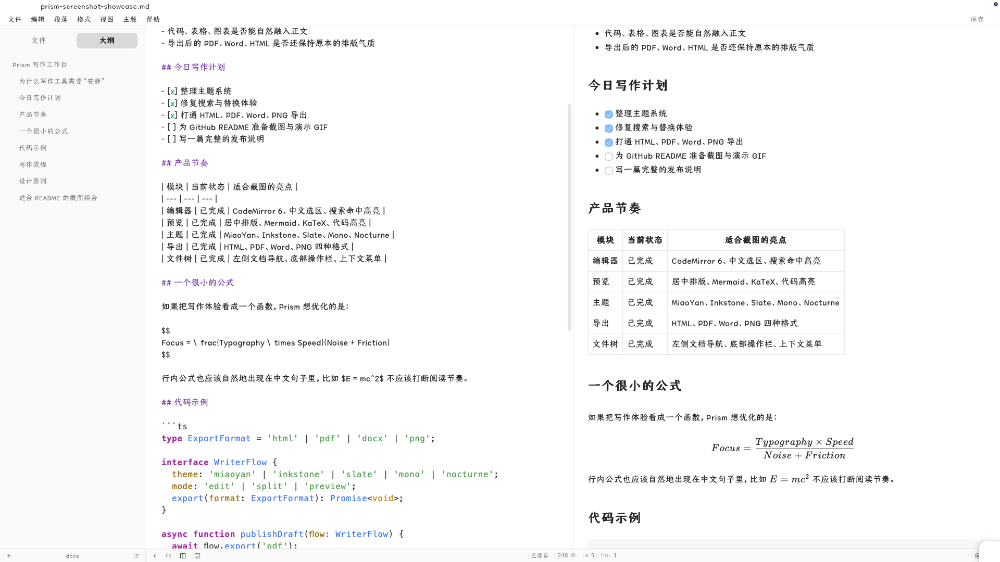
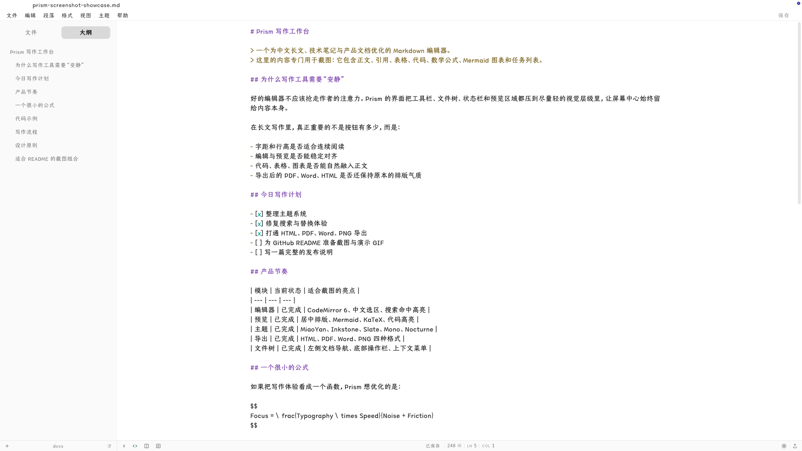
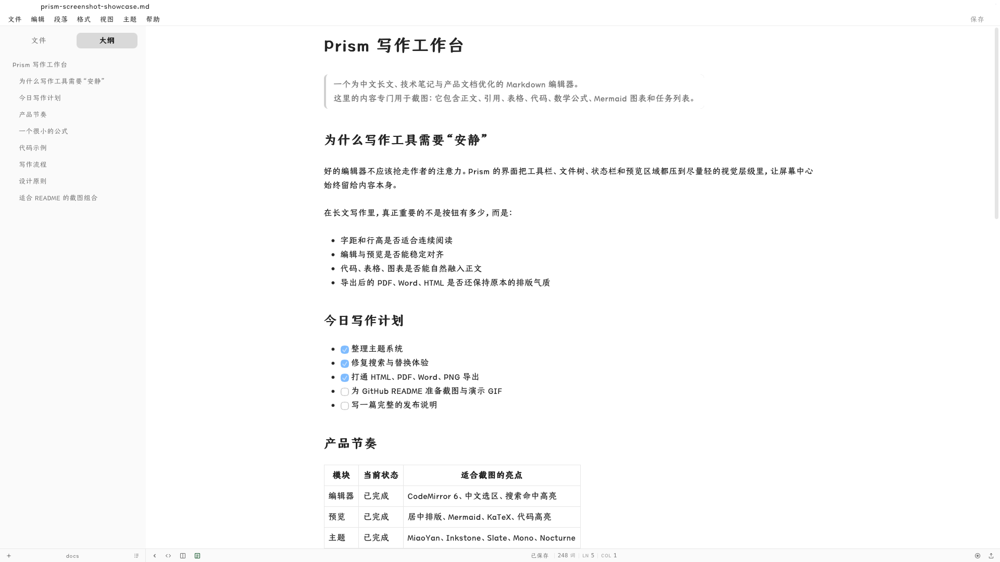
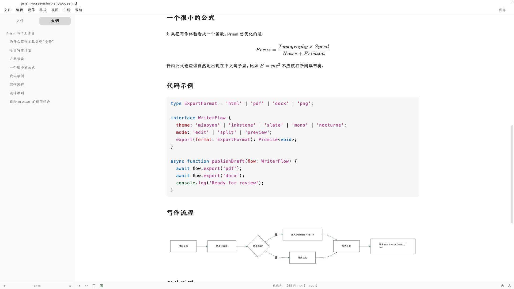
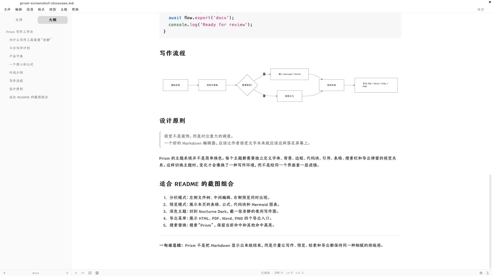
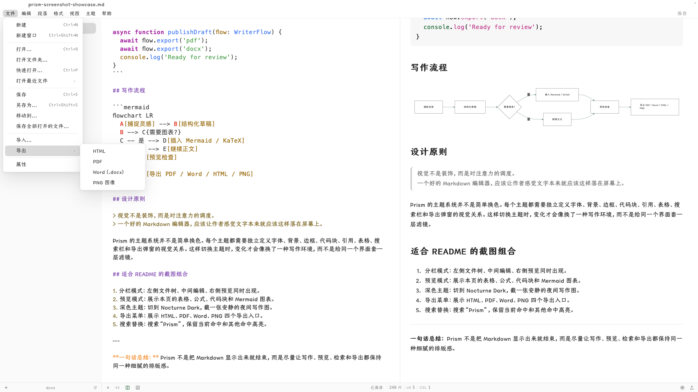

<div align="center">

# Prism

**为中文写作、预览排版和高质量导出而打磨的 Markdown 桌面编辑器。**

<p>
  <a href="README.md">English</a>
  ·
  <a href="README.zh-CN.md">简体中文</a>
</p>

<p>
  <a href="https://github.com/AlexPlum405/Prism/releases/latest">
    
  </a>
  
  
  
  
  
  
</p>

<p>
  <a href="#下载">下载</a>
  ·
  <a href="#为什么做-prism">为什么做 Prism</a>
  ·
  <a href="#截图">截图</a>
  ·
  <a href="#本地开发">本地开发</a>
</p>

<a href="docs/screenshot/prism-intro/prism-intro-final.mp4">
  
</a>

<sub>点击动图可以打开带声音的 MP4 演示。</sub>

</div>

---

## 为什么做 Prism

大多数 Markdown 编辑器都能“渲染 Markdown”。Prism 更在意的是：写作本身的手感。

Prism 是一个基于 Tauri、React、TypeScript 和 CodeMirror 6 的桌面 Markdown 编辑器。它面向中文长文、技术笔记、产品文档和 README 写作，重点打磨编辑、预览、主题、搜索和导出这几件真正影响日常使用体验的事。

它目前适合这些场景：

- 中文长文写作
- 技术笔记和产品文档
- README 和开源项目说明
- 包含代码、表格、图表、公式的 Markdown 文档
- 将带主题排版的文档导出为 HTML、PDF、Word 或 PNG

## 核心亮点

| 能力 | 价值 |
| --- | --- |
| 编辑 / 分栏 / 预览三种模式 | 可以在专注写作、左右对照和纯阅读之间切换。 |
| 中文优先的排版细节 | 字号、行高、预览居中、代码块和中英文混排都按真实写作场景打磨。 |
| CodeMirror 6 编辑器内核 | 提供稳定的文本编辑、选区、搜索、替换和键盘操作体验。 |
| 完整 Markdown 渲染能力 | 支持 GFM、代码高亮、Mermaid、KaTeX、表格、任务列表、引用等。 |
| 五套内容主题 | MiaoYan、Inkstone、Slate、Mono、Nocturne Dark，每套主题都有独立视觉令牌。 |
| 产品级导出 | 支持 HTML、PDF、Word (`.docx`) 和 PNG，并使用 Prism 自己的保存与覆盖弹窗。 |
| 桌面工作区体验 | 左侧文件树、大纲、上下文菜单、状态栏、自动保存等桌面编辑器常用能力。 |

## 下载

最新版本：**v0.1.1**

| 平台 | 下载 |
| --- | --- |
| macOS Apple Silicon | [Prism_0.1.1_aarch64.dmg](https://github.com/AlexPlum405/Prism/releases/latest/download/Prism_0.1.1_aarch64.dmg) |
| Windows 安装包 | [Prism_0.1.1_x64-setup.exe](https://github.com/AlexPlum405/Prism/releases/latest/download/Prism_0.1.1_x64-setup.exe) |
| Windows 绿色版 | [app.exe](https://github.com/AlexPlum405/Prism/releases/latest/download/app.exe) |

当前 macOS 版本尚未签名。如果系统首次启动时拦截应用，请使用 **右键 -> 打开**。

## 截图

### 分栏写作



### 专注编辑



### 预览排版



### 代码与图表

<p>
  
  
</p>

### 导出菜单



## 功能

### 编辑

- 基于 CodeMirror 6 的 Markdown 编辑体验
- 文档搜索、替换、当前命中高亮和结果跳转
- 编辑、分栏、预览三种视图模式
- 自动保存与未保存状态追踪
- 选中文本后的常用 Markdown 浮动工具栏
- 左侧文件树、大纲和上下文菜单

### 预览

- GitHub Flavored Markdown
- 代码块语法高亮
- Mermaid 图表
- KaTeX 行内公式和块级公式
- 表格、任务列表、引用、链接、标记和分隔线
- 居中的长文预览布局

### 主题

Prism 的主题不是简单换色。每个主题都会独立定义字体、背景、边框、代码块、引用、表格、搜索栏和导出弹窗的视觉关系。

- **MiaoYan**：安静的中文写作氛围，温润纸感和细腻间距
- **Inkstone**：偏墨色与纸张的编辑气质
- **Slate**：冷静的蓝灰技术写作风格
- **Mono**：黑白实验笔记感
- **Nocturne Dark**：适合夜间写作的深色主题

### 导出

Prism 当前支持：

- **HTML**：独立的带主题样式文档
- **PDF**：基于预览渲染结果生成
- **Word `.docx`**：结构化文档导出
- **PNG**：完整页面视觉导出

导出流程使用 Prism 自己的保存和同名覆盖弹窗，不再混入系统原生替换提示，因此从写作到交付都保持同一种界面质感。

## 技术栈

| 层级 | 技术 |
| --- | --- |
| 桌面外壳 | Tauri 2 |
| 前端 | React 18 + TypeScript |
| 编辑器 | CodeMirror 6 |
| 状态管理 | Zustand |
| 构建工具 | Vite |
| Markdown 管线 | unified、remark、rehype |
| 数学公式 | KaTeX |
| 图表 | Mermaid |
| 导出 | docx、pdf-lib、html2canvas |
| 测试 | Vitest + Testing Library |

## 本地开发

### 环境要求

- Node.js 18+
- Rust 1.77+
- 当前平台对应的 Tauri 2 环境依赖

### 启动开发环境

```bash
git clone https://github.com/AlexPlum405/Prism.git
cd Prism
npm install
npm run tauri:dev
```

### 构建

```bash
npm run build
npm run tauri:build
```

构建产物位于：

```text
src-tauri/target/release/bundle/
```

### 测试

```bash
npm test
npm run build
```

## 路线图

- 代码签名与更顺滑的 macOS 首次启动体验
- Linux 发布包
- 更复杂 Word 文档的导出保真度
- 主题画廊和主题开发文档
- 拼写检查
- 更多键盘优先的写作工作流

## 贡献

欢迎提交 issue 和 pull request。如果你反馈的是视觉问题，请尽量附上：

- 系统和应用版本
- 当前视图模式：编辑、分栏或预览
- 当前主题
- 截图或最小 Markdown 示例

## 许可证

[MIT](LICENSE)

---

<div align="center">

用 Tauri、React、CodeMirror，以及一点对好排版的执念做成。

如果 Prism 对你有用，欢迎 star，让更多人看到它。

</div>
