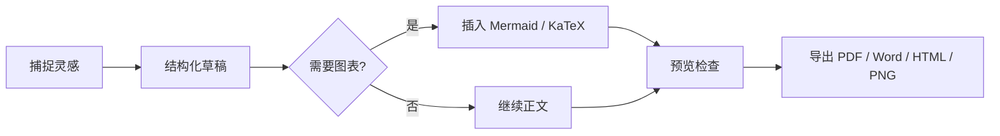

# Prism 写作工作台

> 一个为中文长文、技术笔记与产品文档优化的 Markdown 编辑器。  
> 这里的内容专门用于截图：它包含正文、引用、表格、代码、数学公式、Mermaid 图表和任务列表。

## 为什么写作工具需要“安静”

好的编辑器不应该抢走作者的注意力。Prism 的界面把工具栏、文件树、状态栏和预览区域都压到尽量轻的视觉层级里，让屏幕中心始终留给内容本身。

在长文写作里，真正重要的不是按钮有多少，而是：

- 字距和行高是否适合连续阅读
- 编辑与预览是否能稳定对齐
- 代码、表格、图表是否能自然融入正文
- 导出后的 PDF、Word、HTML 是否还保持原本的排版气质

## 今日写作计划

- [x] 整理主题系统
- [x] 修复搜索与替换体验
- [x] 打通 HTML、PDF、Word、PNG 导出
- [ ] 为 GitHub README 准备截图与演示 GIF
- [ ] 写一篇完整的发布说明

## 产品节奏

| 模块 | 当前状态 | 适合截图的亮点 |
| --- | --- | --- |
| 编辑器 | 已完成 | CodeMirror 6、中文选区、搜索命中高亮 |
| 预览 | 已完成 | 居中排版、Mermaid、KaTeX、代码高亮 |
| 主题 | 已完成 | MiaoYan、Inkstone、Slate、Mono、Nocturne |
| 导出 | 已完成 | HTML、PDF、Word、PNG 四种格式 |
| 文件树 | 已完成 | 左侧文档导航、底部操作栏、上下文菜单 |

## 一个很小的公式

如果把写作体验看成一个函数，Prism 想优化的是：

$$
Focus = \frac{Typography \times Speed}{Noise + Friction}
$$

行内公式也应该自然地出现在中文句子里，比如 $E = mc^2$ 不应该打断阅读节奏。

## 代码示例

```ts
type ExportFormat = 'html' | 'pdf' | 'docx' | 'png';

interface WriterFlow {
  theme: 'miaoyan' | 'inkstone' | 'slate' | 'mono' | 'nocturne';
  mode: 'edit' | 'split' | 'preview';
  export(format: ExportFormat): Promise<void>;
}

async function publishDraft(flow: WriterFlow) {
  await flow.export('pdf');
  await flow.export('docx');
  console.log('Ready for review');
}
```

## 写作流程



## 设计原则

> 视觉不是装饰，而是对注意力的调度。  
> 一个好的 Markdown 编辑器，应该让作者感觉文字本来就应该这样落在屏幕上。

Prism 的主题系统并不是简单换色。每个主题都需要独立定义字体、背景、边框、代码块、引用、表格、搜索栏和导出弹窗的视觉关系。这样切换主题时，变化才会像换了一种写作环境，而不是给同一个界面套一层滤镜。

## 适合 README 的截图组合

1. 分栏模式：左侧文件树、中间编辑、右侧预览同时出现。
2. 预览模式：展示本页的表格、公式、代码块和 Mermaid 图表。
3. 深色主题：切到 Nocturne Dark，截一张安静的夜间写作图。
4. 导出菜单：展示 HTML、PDF、Word、PNG 四个导出入口。
5. 搜索替换：搜索“Prism”，保留当前命中和其他命中高亮。

---

**一句话总结：** Prism 不是把 Markdown 显示出来就结束，而是尽量让写作、预览、检索和导出都保持同一种细腻的排版感。
