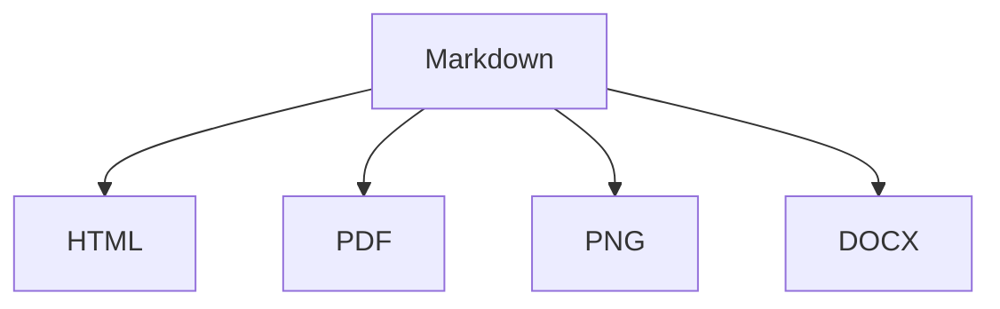

# Prism 复杂导出 Smoke 验证

> 日期：2026-05-15  
> 目标：用同一份复杂 Markdown 文件验证 HTML / PDF / PNG / DOCX 导出在真实桌面运行时的可靠性。  
> 计划来源：`docs/prism-product-optimization-plan.md` 第 7 节“导出工作台”。  
> 当前状态：自动化 pipeline 产物 smoke、命令入口集成 smoke、真实 Prism UI 四格式导出 smoke 均已闭环；真实 Pandoc citeproc 仍受本机未安装 Pandoc 阻塞。

## 1. 覆盖范围

本 smoke 覆盖：

- YAML front matter 覆盖：`title`、`author`、`date`、`template`、`paper`、`margin`、`toc`
- 中文正文、英文单词、代码块、表格、任务列表、引用块
- Mermaid 图表
- KaTeX 行内公式和块级公式
- 本地图片
- Pandoc citekey 占位与引用回退提示
- 页眉页脚和页码
- HTML / PDF / PNG / DOCX 四种格式

本 smoke 不覆盖：

- 真实 Pandoc citeproc 生成参考文献；该项见 `docs/verification/prism-pandoc-citation-html-smoke.md`
- macOS 签名、公证、updater；该项见 `docs/prism-macos-release.md`
- Windows 安装器；该项见 `docs/verification/prism-windows-release-smoke.md`

## 2. 现有自动化覆盖

当前自动测试已经覆盖一部分导出逻辑：

- `src/domains/export/goldenFixture.ts` 提供包含 front matter、中文、表格、代码、Mermaid、KaTeX 的 golden fixture。
- `src/domains/export/exportPipeline.test.ts` 覆盖 HTML golden 导出，检查 TOC、heading anchor、表格、代码高亮、KaTeX、Mermaid 渲染。
- `src/domains/export/exportPipeline.test.ts` 覆盖 DOCX golden 导出，检查 TOC、中文、表格、代码、页眉页脚、页码，并确认 Mermaid 源码不会原样进入 DOCX 且 `word/media/` 中存在图片。
- `src/domains/export/exportPipeline.test.ts` 覆盖 DOCX GFM task list 导出，检查已完成 / 未完成任务分别写成可读的 `☑` / `☐` 标记。
- `src/domains/export/exportPipeline.test.ts` 覆盖 PNG / PDF / DOCX / HTML progress stage。
- `src/domains/commands/registry.test.ts` 覆盖导出进度事件接线：pipeline `onProgress` 会变成 `prism-export-progress` 事件，导出成功或失败后都会发送 `{ visible: false }` 清理进度状态。
- `src/domains/export/templates.test.ts` 覆盖 front matter 覆盖导出设置、模板默认值、DOCX 字体策略、citation / pandoc 设置传递。
- `src/domains/export/frontMatter.test.ts` 覆盖 YAML front matter 解析和非法值回退。
- `src/domains/export/exportPipeline.test.ts` 的 `writes complex export smoke artifacts for all supported formats` 会把同一份复杂 Markdown 通过 HTML / PDF / PNG / DOCX pipeline 写入 `.codex-smoke/complex-export/out/`，再读取产物检查 HTML 目录、表格、KaTeX、Mermaid、图片路径、citekey 回退、PDF A4 页面、PNG 签名、DOCX XML、DOCX media 和 Mermaid 非源码输出。
- `src/domains/export/exportPipeline.test.ts` 覆盖 Pandoc citeproc 返回 HTML 的安全清理：`javascript:` URL、事件属性、inline style 和 `<script>` 不会进入最终 HTML 导出。
- `src/domains/commands/exportCommand.integration.test.ts` 从命令注册表触发 `exportHtml` / `exportPdf` / `exportPng` / `exportDocx`，不 mock Prism export domain，验证四种格式都会走真实 pipeline 写出产物、无 `prism-export-failure` 事件、并记录每个文件的 export history。
- `src/App.recovery.test.tsx` 覆盖 App 层导出进度与失败诊断：`prism-export-progress` 会显示/隐藏进度状态并清理旧失败浮层；`prism-export-failure` 会展示诊断浮层，诊断文本可复制到系统剪贴板，并显示复制成功 toast。
- `src/domains/commands/registry.test.ts` 覆盖导出失败诊断中的 warning 汇总：pipeline 在失败前产生的 Pandoc / CSL / fallback warning 会进入可复制诊断文本，避免用户只拿到最终错误而丢失回退原因。

这些测试证明 pipeline 的主要分支能生成可读产物，但不能替代真实桌面 UI 的导出对话框、Tauri 文件写入权限、实际产物打开检查和视觉保真。尤其是自动化 PNG 仍来自 `html2canvas` 测试替身，只能验证文件生成和格式签名，不作为视觉正确性证据。

## 3. Smoke 工作区

建议固定使用仓库内临时目录，验证完成后可删除：

```text
.codex-smoke/complex-export/
  complex-export.md
  assets/
    prism-export-figure.png
  out/
    complex-export.html
    complex-export.pdf
    complex-export.png
    complex-export.docx
```

## 4. 准备 fixture

创建 `assets/prism-export-figure.png`。任意可读 PNG 都可以；建议使用 640x360 的浅色图，方便观察是否被拉伸或丢失。

创建 `complex-export.md`：

```markdown
---
title: 导出 Smoke 验收文档
author: Prism QA
date: 2026-05-15
template: academic
paper: a4
margin: standard
toc: true
---

# 导出 Smoke 验收文档

这是一段中文长文内容，用于验证 Prism 的复杂导出。English words 与中文混排，行内公式 $E = mc^2$ 应该正常渲染。

引用占位：[@doe2024]。如果 Pandoc 未检测成功，导出应保留 citekey 占位并给出 warning，不应崩溃。


## 表格与任务

| 项目 | 期望 | 状态 |
| --- | --- | --- |
| 中文 | 保留中文字符 | 通过 |
| 表格 | 保留表格结构 | 通过 |
| Mermaid | 导出为图表或图片 | 待检 |

- [x] 已完成的任务
- [ ] 待完成的任务

> 引用块应该有明确层级，不能贴边或丢失正文。

## 代码

```ts
const title = 'Prism Export Smoke';
console.log(title);
```

## Mermaid



## KaTeX

$$
\int_0^1 x^2 dx = \frac{1}{3}
$$
```

## 5. Prism 设置

在设置中心确认：

- `导出 -> Front matter 覆盖`：开启
- `导出 -> 目录`：开启，除非 front matter 已覆盖
- `导出 -> PDF 纸张`：A4
- `导出 -> PDF 边距`：标准
- `导出 -> 页眉页脚`：开启
- `导出 -> 页眉`：`{title}`
- `导出 -> 页脚`：`{filename} · {page}/{pages}`
- `导出 -> 参考文献文件`：可留空；若填写，必须是 `.bib` / `.bibtex` / `.json`
- `导出 -> CSL 样式文件`：可留空；若填写，必须是 `.csl`

如果本机未安装 Pandoc，本 smoke 仍应通过基础导出，只是 citekey 以占位形式保留。

## 6. 操作步骤

1. 启动 Prism。
2. 打开 `.codex-smoke/complex-export/complex-export.md`。
3. 切到分栏或预览，确认 Mermaid、KaTeX、表格、本地图片能在预览中显示或给出可定位错误。
4. 分别执行：
   - `导出 -> HTML`
   - `导出 -> PDF`
   - `导出 -> PNG`
   - `导出 -> Word (.docx)`
5. 输出到 `.codex-smoke/complex-export/out/`。
6. 如果导出失败，打开失败诊断，复制诊断文本并记录在本文档末尾。

## 7. 产物检查表

### HTML

- 文件能在浏览器打开。
- `<title>` 是 `导出 Smoke 验收文档`。
- 页面有目录。
- 中文、表格、代码高亮、KaTeX、Mermaid、本地图片都可见。
- 若 Pandoc 未就绪，citekey 以占位显示且导出 warning 说明原因。

### PDF

- PDF 能打开，页面尺寸为 A4。
- 页眉显示文档标题。
- 页脚显示文件名和页码。
- 中文、表格、代码块、KaTeX、Mermaid、本地图片可见。
- 没有明显空白页、裁切、内容重叠。

### PNG

- PNG 能打开。
- 内容不应只有空白画布。
- 页面宽度、字体、代码块、表格、Mermaid、本地图片可见。
- 长内容如果被裁切，需记录裁切位置和是否符合当前产品预期。

### DOCX

- Word / Pages / LibreOffice 至少一种能打开文件。
- 标题、正文、表格、代码块、引用块、任务列表可读。
- Mermaid 不应以原始 `graph TD` 源码出现在正文中；应以图片或可接受 fallback 呈现。
- 页眉页脚包含标题、文件名和页码。
- 中文不乱码。

## 8. 通过标准

四种格式均成功生成，且检查表无 P0 问题，即可认为“复杂导出 smoke 通过”。

P0 问题定义：

- 任一格式导出崩溃或无产物。
- 产物为空白或主要正文缺失。
- 中文乱码。
- DOCX 中 Mermaid 只保留源码且没有任何图像或 fallback 说明。
- 失败诊断为空或无法解释导出阶段。

## 9. 本轮记录

本轮已完成自动化 pipeline 产物 smoke、命令入口集成 smoke，以及真实 Prism UI 四格式导出 smoke。

### 2026-05-15 自动化 pipeline 产物 smoke

执行命令：

```bash
npm test -- --run src/domains/export/exportPipeline.test.ts
```

结果：

- 通过：`20 passed (20)`。
- 产物目录：`.codex-smoke/complex-export/out/`。
- HTML：`.codex-smoke/complex-export/out/complex-export.html`，已由测试读取并确认标题、目录、表格、KaTeX、Mermaid、图片路径和 citekey 占位。
- PDF：`.codex-smoke/complex-export/out/complex-export.pdf`，已由 `pdf-lib` 读取并确认至少 1 页，首页尺寸接近 A4。
- PNG：`.codex-smoke/complex-export/out/complex-export.png`，已确认 PNG 文件签名。当前测试环境使用 `html2canvas` 替身，不能证明真实视觉保真。
- DOCX：`.codex-smoke/complex-export/out/complex-export.docx`，已由 `jszip` 读取 `word/document.xml` 和 `word/media/`；确认中文、代码、表格存在，Mermaid 未以 `graph TD` 源码留在正文，并存在 media 文件。
- Pandoc 状态：本自动化 smoke 配置为 Pandoc 未检测成功，验证 citekey 保留占位并产生 warning；真实 citeproc 仍见 `docs/verification/prism-pandoc-citation-html-smoke.md`。

### 2026-05-15 DOCX task list 补强

- `src/domains/export/exportPipeline.ts` 对 GFM task list 的 `checked` 状态做显式映射，DOCX 中已完成任务使用 `☑`，未完成任务使用 `☐`。
- `src/domains/export/exportPipeline.test.ts` 新增 DOCX task list 产物级回归，读取 `word/document.xml` 验证 `☑ 已完成` 与 `☐ 待确认` 均存在。
- `npm test -- --run src/domains/export/exportPipeline.test.ts`：通过，1 file / 21 tests。
- `src/App.recovery.test.tsx` 新增导出进度 UI 回归：App 接收 `prism-export-progress` 后展示进度、清理旧失败浮层，并在 `visible: false` 时隐藏进度。
- `src/App.recovery.test.tsx` 新增导出失败诊断浮层回归：App 接收 `prism-export-failure` 后展示诊断 textarea，点击“复制诊断文本”会写入 `navigator.clipboard` 并显示成功 toast。
- `npm test -- --run src/App.recovery.test.tsx`：通过，1 file / 5 tests。
- `src/domains/commands/registry.test.ts` 新增导出进度事件接线回归：`exportPdf` 收到 pipeline progress 后依次派发可见进度事件，并在成功或失败后派发 `{ visible: false }`。
- `src/domains/commands/registry.ts` 的导出失败诊断现在会收集 pipeline `onWarning` 消息，并在失败诊断里追加“导出警告”段落；这覆盖 Pandoc 未检测成功、CSL 后缀不合法、citekey 回退等失败前上下文。
- `src/domains/commands/registry.test.ts` 补充导出 warning 诊断回归：失败前产生的 `Pandoc 未检测成功` 与 `CSL 样式文件后缀需要是 .csl` 会同时出现在可复制诊断文本中。
- `npm test -- --run src/domains/commands/registry.test.ts`：通过，1 file / 19 tests。
- `npm test -- --run`：通过，54 files / 309 tests。
- `npm run build`：通过，仅有既有 Vite large chunk warning。
- `git diff --check`：通过。

### 2026-05-15 命令入口集成 smoke

- `src/domains/commands/exportCommand.integration.test.ts` 新增命令入口集成测试：通过 `runCommand()` 分别执行 `exportHtml`、`exportPdf`、`exportPng`、`exportDocx`，使用真实 `resolveExportOptions()` 与真实 `exportDocument()` 动态 adapter，不 mock 导出 domain。
- 产物目录：`.codex-smoke/complex-export/out/`。
- 产物文件：`command-export.html`、`command-export.pdf`、`command-export.png`、`command-export.docx`。
- HTML：读取文件并确认标题、目录与 Mermaid 渲染文本存在。
- PDF：用 `pdf-lib` 打开并确认至少 1 页。
- PNG：确认 PNG 文件签名。
- DOCX：用 `jszip` 读取 `word/document.xml`，确认中文标题存在且 Mermaid 源码 `graph TD` 未原样进入正文。
- 命令状态：确认没有收到 `prism-export-failure`；确认 `requestExportPath` 被调用 4 次；确认 `recordExportHistory` 按 `html`、`pdf`、`png`、`docx` 记录四条历史。
- `npm test -- --run src/domains/commands/exportCommand.integration.test.ts`：通过，1 file / 1 test。
- 限制：该测试仍运行在 jsdom + mocked Tauri fs/dialog 环境，不能替代真实 Prism 桌面窗口、系统保存面板和人工打开产物检查。

### 2026-05-15 导出 pipeline 首包拆分

- `src/domains/export/index.ts` 不再静态导入 HTML / PDF / PNG / DOCX adapters；`exportDocument()` 在用户真正执行导出命令时按格式动态加载 adapter。
- `vite.config.ts` 通过 `build.rollupOptions.output.manualChunks` 把 `exportPipeline`、`docx`、`pdf-lib`、`html2canvas` 拆到独立 chunk，避免主界面启动时预先携带完整导出链路。
- 构建前最近记录中主入口为 `dist/assets/index-BBLlhZWe.js`：`2,620.04 kB`，gzip `834.05 kB`。
- 构建后主入口为 `dist/assets/index-xiCkvw2V.js`：`1,950.05 kB`，gzip `632.95 kB`。
- 新增按需 chunk：
  - `export-pipeline-2PHjXNcI.js`：`667.34 kB`，gzip `202.12 kB`。
  - `vendor-docx-LHXn8vCj.js`：`407.22 kB`，gzip `119.22 kB`。
  - `vendor-pdf-CWvVLaQp.js`：`437.04 kB`，gzip `180.61 kB`。
  - `vendor-html2canvas-QH1iLAAe.js`：`202.38 kB`，gzip `48.04 kB`。
- `npm test -- --run src/domains/commands/registry.test.ts src/domains/export/exportPipeline.test.ts`：通过，2 files / 41 tests。
- `npm run build`：通过；Vite large chunk warning 仍存在，主要来自 `export-pipeline` 与 Mermaid 相关异步 chunk，但导出链路已不再位于主入口 chunk。

### 2026-05-15 真实 UI 尝试

已生成 fixture：

```text
.codex-smoke/complex-export/complex-export.md
.codex-smoke/complex-export/assets/prism-export-figure.png
```

已重新构建当前代码对应的 macOS app bundle：

```bash
npm run tauri -- build --bundles app
```

结果：

- 前端 `npm run build` 通过，仅有既有 Vite large chunk warning。
- Rust release 编译通过。
- `.app` 生成成功：`src-tauri/target/release/bundle/macos/Prism.app`。
- `.app.tar.gz` updater bundle 生成后，命令因缺少 `TAURI_SIGNING_PRIVATE_KEY` 返回 1：`A public key has been found, but no private key`。因此本轮只能使用 `.app` 做运行时 smoke，不能视为 updater 签名闭环。

已尝试启动当前 app：

```bash
open -n -a /Users/Alex/AI/project/Prism/src-tauri/target/release/bundle/macos/Prism.app /Users/Alex/AI/project/Prism/.codex-smoke/complex-export/complex-export.md
```

已取得的真实 UI 证据：

- `osascript` 读取到 Prism 标准窗口：标题 `Prism`，位置 `{314, 91}`，尺寸 `{1100, 760}`。
- `screencapture` 成功截到窗口可见状态，证据文件：`.codex-smoke/complex-export/prism-opened-preview.png`。
- 截图中可见：
  - 文档标题栏为 `complex-export.md`。
  - 左侧文件列表选中 `complex-export.md`。
  - 主编辑/预览区域显示 front matter、标题、正文、citekey 占位、本地图片 Markdown、表格段落。
  - 底部状态栏显示 `已保存`。

此前阻塞：

- Prism release app 进程存在。
- Computer Use 本轮读取 `Prism` 或列出 apps 时返回 `codex app-server exited before returning a response`。
- AppleScript / System Events 可读取窗口元信息，但坐标点击应用内“文件”菜单时返回 `-25200`，随后 Prism 进程仍在但没有可读窗口，重新 `open` 文件也未恢复窗口。
- `screencapture` 在该失败状态后只能得到黑屏截图，不能作为 UI 通过证据。
- 因此当时不能宣称真实 UI 四格式导出通过；该记录保留为历史失败尝试。

### 2026-05-15 真实 Prism UI 四格式导出 smoke

Checkpoint：

- 目标：用真实 macOS Prism `.app` 通过应用内导出菜单生成 HTML / PDF / PNG / DOCX，并确认产物不是空文件、不是测试替身结果。
- 运行方式：`npm run tauri:build:app-smoke` 构建 `src-tauri/target/release/bundle/macos/Prism.app`，随后打开 `.codex-smoke/complex-export/complex-export.md`。
- Prism 进程：Computer Use 读取到 bundle `com.prism.editor.v1`，窗口 URL 为 `tauri://localhost/?file=...complex-export.md&folder=...complex-export`。
- Pandoc 状态：`pandoc --version` 返回 `zsh:1: command not found: pandoc`；因此 citeproc 参考文献仍未覆盖，基础导出必须保留 citekey 占位。

真实 UI 操作：

- 通过底部状态栏“导出”菜单分别选择 `导出为 PDF`、`导出为 HTML`、`导出为 PNG 图像`、`导出为 Word (.docx)`。
- 每次都使用 Prism 自带导出 modal 修改文件名并点击“导出”。
- PDF 导出前曾暴露真实 bug：阶段停在“正在渲染图表”，失败诊断为 `图像渲染失败: Attempting to parse an unsupported color function "color"`。原因是 `html2canvas` 不支持 WebKit 计算样式中的现代 CSS `color(...)` 函数。
- 本轮最小修复后，PDF / PNG 栅格导出使用 raster-safe CSS，并在调用 `html2canvas` 前把 computed color 函数归一为 `rgb(...)` / `rgba(...)`；HTML 导出仍保留完整主题 CSS。

产物：

```text
.codex-smoke/complex-export/ui-raster-fixed.html
.codex-smoke/complex-export/ui-raster-fixed.pdf
.codex-smoke/complex-export/ui-raster-fixed.png
.codex-smoke/complex-export/ui-raster-fixed.docx
```

产物检查：

- `ls -lh`：
  - HTML：`75M`
  - PDF：`141K`
  - PNG：`395K`
  - DOCX：`14K`
- `file`：
  - HTML：`HTML document text, Unicode text, UTF-8 text`
  - PDF：`PDF document, version 1.7`
  - PNG：`PNG image data, 2054 x 3316, 8-bit/color RGBA, non-interlaced`
  - DOCX：`Microsoft Word 2007+`
- `pdf-lib`：PDF 可加载，`pages = 2`，首页尺寸 `595.28 x 841.89`，符合 A4。
- `sips`：PNG `pixelWidth = 2054`，`pixelHeight = 3316`。
- HTML 内容检查：包含中文标题、`@doe2024` citekey、`<table`、`<td>`、KaTeX class、Mermaid SVG、`prism-citation`。
- `jszip` 读取 DOCX：`word/document.xml` 长度 `15686`，`word/media/` 包含 1 个 SVG 和 1 个 PNG；中文标题、表格文本、`Mermaid`、已完成 / 待完成任务均存在；`graph TD` 未原样进入正文。
- `textutil -convert txt -stdout`：macOS 系统可解析 DOCX，输出保留中文标题、正文、表格文本、`☑ 已完成的任务`、`☐ 待完成的任务`。
- `qlmanage -t -s 1024`：DOCX 可生成 Quick Look thumbnail。

结论：

- 真实 Prism UI 四格式导出通过。
- 本次发现并修复 PDF / PNG 栅格导出对现代 CSS color function 的兼容性问题。
- 真实 Pandoc citeproc 仍未覆盖；阻塞项是本机无 `pandoc`。

验证命令：

- `npm test -- --run src/domains/commands/exportCommand.integration.test.ts src/domains/commands/registry.test.ts src/domains/export/exportPipeline.test.ts`：通过，3 files / 45 tests。
- `npm test -- --run`：通过，55 files / 319 tests。
- `npm run build`：通过，仅有既有 Vite large chunk warning。

### 2026-05-17 独立导出 WebView 卡死修复 smoke

背景：

- 目标：验证导出任务迁入独立 WebView 后，复杂 Mermaid 文档不会长期停在“正在导出 / 正在渲染图表”。
- 失败复现：真实 Prism `.app` 导出 `.codex-smoke/preview-heavy/preview-heavy.md` 为 HTML 时，进度停在“正在渲染图表”，20 分钟后失败。
- 失败诊断：
  - 时间：`2026-05-17T07:04:49.003Z`
  - 格式：`HTML (html)`
  - 阶段：`正在渲染图表`
  - 输出路径：`.codex-smoke/preview-heavy/preview-heavy-webview-smoke.html`
  - 错误：`独立导出 WebView 执行超时，请拆分文档或减少复杂图表后重试。`

修复：

- 独立导出 WebView 不再创建到 `-32000px` 离屏位置，改为停在主窗口背后的 `24 x 24` 极小可见窗口，并保持 `backgroundThrottling: disabled`，避免 WebKit 把导出上下文判定为隐藏后暂停 `requestAnimationFrame` / timer / 布局回调。
- 导出管线的 `nextFrame()` 增加 timer fallback，`requestAnimationFrame` 被节流或不回调时仍会继续推进。
- Mermaid 渲染改为逐个图表报告进度：`正在渲染图表 1 / N`，独立 WebView 主控增加 90 秒无进度 watchdog，避免用户只能等 20 分钟才看到失败。
- DOCX Mermaid 图片链路也增加 Mermaid render / SVG 图片加载超时，避免 Word 导出在同类异步渲染点无期限等待。

真实 UI 复测：

- 构建：`npm run tauri:build:app-smoke`
- App：`src-tauri/target/release/bundle/macos/Prism.app`
- 输入：`.codex-smoke/preview-heavy/preview-heavy.md`
- 操作：通过命令面板执行 `导出为 HTML`，输出文件名改为 `preview-heavy-webview-smoke-fixed.html`。
- 结果：文件在几秒内生成，不再停留在“正在渲染图表”。
- 产物：`.codex-smoke/preview-heavy/preview-heavy-webview-smoke-fixed.html`
- 文件大小：`76M`
- 内容检查：
  - `svgCount = 20`
  - `mermaidFailures = 1`
  - 失败的 1 个 Mermaid 是 fixture 内尾部故意保留的非法 Mermaid，已按单图 fallback 写入错误文本，没有阻断整份 HTML 导出。

验证命令：

- `npm test -- --run src/domains/export/isolatedWebviewExport.test.ts src/domains/export/index.test.ts src/domains/export/exportPipeline.test.ts src/domains/commands/registry.test.ts src/domains/workspace/components/StatusBar.test.tsx`：通过，5 files / 69 tests。
- `npm test -- --run`：通过，59 files / 353 tests。
- `npm run build`：通过，仅有既有 Vite large chunk warning。
- `git diff --check`：通过。
- `npm run tauri:build:app-smoke`：通过，生成 `src-tauri/target/release/bundle/macos/Prism.app`。
